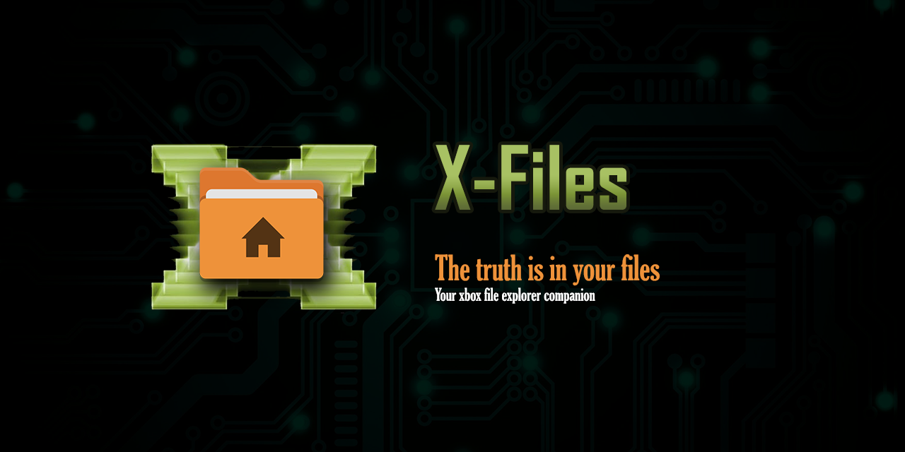

<p align="center">
  
</p>

<h1 align="center">X-Files</h1>

<p align="center">
  <strong>The file browser your Xbox always needed.</strong><br/>
  Navigate, preview, play, and manage your files — all from the couch, all with a gamepad.
</p>

<p align="center">
  <a href="docs/SPEC.md">Spec</a> ·
  <a href="docs/ARCHITECTURE.md">Architecture</a> ·
  <a href="docs/ROADMAP.md">Roadmap</a> ·
  <a href="docs/DECISIONS.md">Decisions</a> ·
  <a href="docs/DEPLOY-XBOX.md">Deploy to Xbox</a>
</p>

---

## Why X-Files?

Xbox has no built-in way to browse files on USB drives, preview images, listen to music,
or manage your media library. **X-Files fills that gap** — a full-featured file manager
built specifically for the console experience.

### What makes it different

- **Gamepad-first, couch-friendly.** Every action reachable with D-pad and face buttons.
  No keyboard, no mouse, no touch required. Designed for the TV screen distance.

- **Miller-column navigation.** Three columns (Parent | Current | Preview) let you see
  where you are, what's here, and what's inside — all at once. Navigate without opening
  files just to check their contents.

- **Live preview as you navigate.** Move the cursor over any file and instantly see its
  contents: text files, images, code with syntax highlighting, audio with VU meter,
  video playback. No "open → close → next file" tedium.

- **Built-in audio player with VU meter.** Play MP3s directly from the file browser with
  a real-time 26-bar spectrum analyzer. Pause, seek, skip tracks, adjust volume — all
  from the gamepad. Winamp vibes on your Xbox.

- **Archive browsing.** Navigate inside `.zip`, `.7z`, and `.rar` files as if they were
  folders. Preview text and images inside archives without extracting.

- **Retro aesthetic.** Custom dark theme inspired by classic dashboard UIs. No Fluent
  Design chrome — just clean, sharp visuals that feel native to the console.

- **Fast.** P/Invoke directory scanning, no unnecessary abstraction layers. Navigates
  thousands of files without lag.

## Features

### File browsing
- Browse all connected drives (internal + USB)
- Three-column Miller layout with live preview
- Folders-first sorting, alphabetical within type
- Hidden/system files filtered automatically
- Drill in (A/Right) and drill out (B/Left) navigation
- Page navigation with LB/RB/LT/RT (±8 items)
- X to refresh current directory

### Preview
- **Text files**: plain text preview with scroll
- **Images**: thumbnail preview with size info (PNG, JPG, BMP, GIF, WebP)
- **SVG**: rendered in WebView
- **Code**: syntax highlighting for 40+ languages (highlight.js)
- **Audio**: ID3 metadata (title, artist, album, album art) + VU meter
- **Video**: inline playback with transport controls
- **Archives**: browse zip/7z/rar contents as virtual folders

### Audio player
- Built-in playback via AudioGraph (native MediaFoundation decoding)
- Real-time spectrum analyzer (26 bars × 12 segments)
- Green → yellow → red color gradient with peak hold indicators
- Play/pause (A), seek (LB/RB), volume (Right Analog)
- Fullscreen mode with album art and metadata
- Next/previous track navigation
- Works on external USB drives (stream fallback via MediaSourceAudioInputNode)

### File operations
- Y button context menu
- Rename with text input dialog
- Delete with confirmation dialog
- Copy, Move, Extract (backend implemented, UI pending)

### Controls

| Button | Action |
|---|---|
| D-pad / Left Stick | Navigate up/down |
| D-pad Right / A | Enter folder / Play file / Toggle play-pause |
| D-pad Left / B | Go back (drill out) / Close fullscreen |
| LB / LT | Page up (−8 items) / Seek backward |
| RB / RT | Page down (+8 items) / Seek forward |
| Y | Context menu (rename, delete, copy, etc.) |
| X | Refresh current directory |
| Right Analog Stick | Scroll preview / Adjust volume (fullscreen) |
| Start | Settings (placeholder) |
| Select | Info (placeholder) |

## Screenshots

> *Screenshots coming soon — deployed and tested on real Xbox hardware.*

## Getting started

### Prerequisites

- **Xbox One** or **Xbox Series X|S** with Developer Mode enabled

That's it. No PC, no Visual Studio, no special tools needed.

### Install

1. Enable Developer Mode on your Xbox (install "Dev Home" from Microsoft Store).
2. Download the `.appxbundle` package from [releases](https://github.com/marcelofrau/x-files-uwp/releases).
3. Open Xbox Device Portal from any device on your network: `https://<XBOX-IP>:11443`
4. Go to **Apps** → **Add** → select the package → Install.

See [DEPLOY-XBOX.md](docs/DEPLOY-XBOX.md) for detailed steps.

## Project structure

```
XFiles/
├── Audio/              # AudioLevelService (playback + VU meter), FFT, COM interop
├── Controls/           # XAML views (MillerColumnsPage, ColumnListView, VuMeterBar,
│   │                   #   MediaPreviewControl, FileActionSheet, etc.)
│   └── XAML + .cs      # Custom ControlTemplates (no Fluent chrome)
├── Navigation/         # ColumnNavigator, GamepadInputService, INavigable
├── FileSystem/         # DirectoryScanner (P/Invoke), FileEntry, ArchiveBrowser,
│   │                   #   FileOperations, Id3Tag
│   └── P/Invoke        # FindFirstFileExFromAppW, GetLogicalDrives (Xbox-compatible)
├── Theming/            # RetroTheme.xaml, AppTheme (JSON-backed)
├── Assets/             # Icons, gamepad button images, OSD images
└── App.xaml            # Entry point, theme merging
```

## Technical highlights

- **P/Invoke directory scanning** — `FindFirstFileExFromAppW` + `GetLogicalDrives` for
  reliable access to external drives on Xbox (where `StorageFolder` APIs fail).
- **AudioGraph with stream fallback** — `MediaSourceAudioInputNode` enables playback +
  VU meter on drives where `StorageFile` APIs return `E_ACCESSDENIED`.
- **Zero Fluent Design chrome** — every control uses custom `ControlTemplate`/`Style`.
  Gamepad focus (`XYFocusUp/Down/Left/Right`) still works natively via XAML.
- **Inlined highlight.js** — syntax highlighting for 40+ languages without external
  dependencies. Aco theme CSS + Inconsolata font embedded as base64.
- **Serilog logging** — every operation, input event, and exception logged. Daily log
  rotation, stored in `ApplicationData.Current.LocalFolder/logs/`.

## Key docs

| Doc | What it covers |
|---|---|
| [SPEC.md](docs/SPEC.md) | Functional spec, MVP scope, done criteria |
| [ARCHITECTURE.md](docs/ARCHITECTURE.md) | Layered architecture, data flow, column model |
| [GAMEPAD.md](docs/GAMEPAD.md) | Button mapping, INavigable contract |
| [FILEBROWSER.md](docs/FILEBROWSER.md) | FileEntry model, DirectoryScanner, sorting |
| [ARCHIVES.md](docs/ARCHIVES.md) | zip/7z/rar via SharpCompress |
| [AUDIO-VISUALIZATION.md](docs/AUDIO-VISUALIZATION.md) | VU meter architecture, AudioGraph, FFT |
| [UI-THEMING.md](docs/UI-THEMING.md) | ControlTemplate conventions |
| [ROADMAP.md](docs/ROADMAP.md) | Phased plan with done criteria |
| [DECISIONS.md](docs/DECISIONS.md) | ADRs — why XAML, why SharpCompress, etc. |
| [DEPLOY-XBOX.md](docs/DEPLOY-XBOX.md) | Developer Mode, Device Portal, sideload steps |

## License

[GPL-3.0](LICENSE) — free software; you can redistribute it and/or modify it under the
terms of the GNU General Public License as published by the Free Software Foundation,
either version 3 of the License, or (at your option) any later version.
