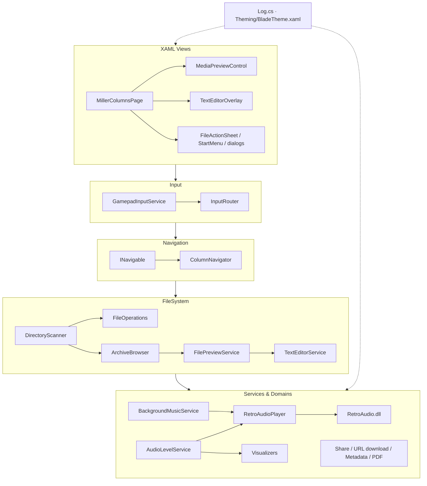
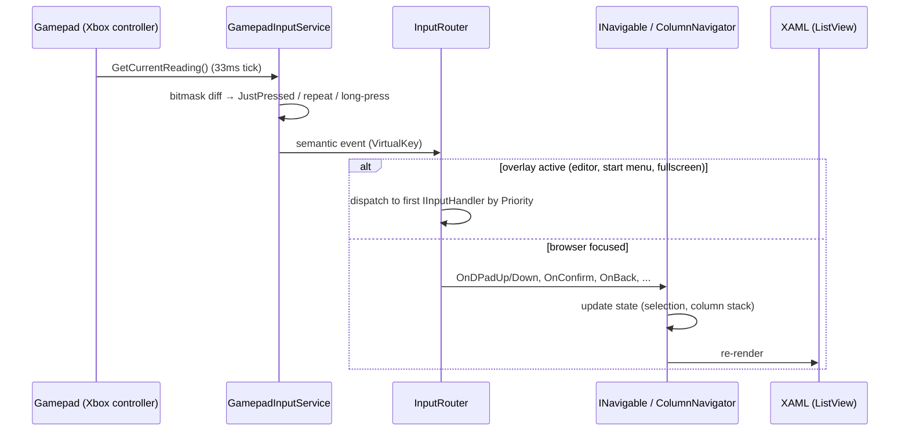
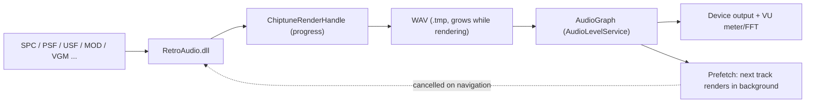
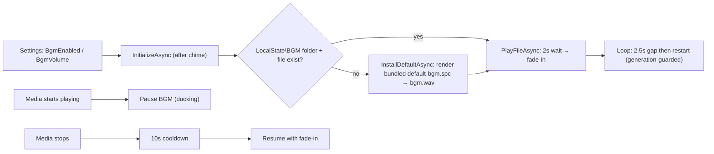

# Architecture — X-Files

## Overview

X-Files is a gamepad-oriented UWP file browser, inspired by yazi's Miller column UX
(live preview, 3 columns), but implemented natively in C#/XAML to run well on Xbox
(native UWP gamepad focus), without reusing any code from yazi (see `DECISIONS.md`,
ADR-003).

## Layers



ASCII equivalent:

```
┌──────────────────────────────────────────────────────────────┐
│  XAML Views (Controls/MillerColumnsPage, MediaPreviewControl, │  ← binding, templates, visual focus
│  TextEditorOverlay, StartMenu, dialogs)                       │
├──────────────────────────────────────────────────────────────┤
│  Input (GamepadInputService, InputRouter)                      │  ← polling, edge-detect, overlay dispatch
├──────────────────────────────────────────────────────────────┤
│  Navigation (INavigable, ColumnNavigator)                      │  ← semantic navigation state, no UI
├──────────────────────────────────────────────────────────────┤
│  FileSystem (DirectoryScanner, FileEntry, ArchiveBrowser,      │  ← disk access, P/Invoke, SharpCompress
│  FileOperations, FilePreviewService, TextEditorService)        │
├──────────────────────────────────────────────────────────────┤
│  Services & Domains (media, metadata, PDF, QR share, settings) │  ← Audio, Metadata, Visualizers, Services
└──────────────────────────────────────────────────────────────┘
```

Cross-cutting: `Log.cs` (Serilog), `Theming/BladeTheme.xaml` (custom ControlTemplates).

Layer rule: each layer only knows the layer directly below it. `Navigation` knows nothing
about XAML; `FileSystem` knows nothing about gamepad. Pure-logic classes
(`FilenameParser`, `Id3Tag`, `RomHeaderParser`, `FftHelper`, ...) have no UWP
dependencies and are unit-tested from a plain net8.0 MSTest project (`tests/`, linked
source — no UWP host needed).

## Input → Screen Flow



ASCII equivalent:

```
Windows.Gaming.Input.Gamepad.GetCurrentReading()
        │  (DispatcherTimer tick, ~33ms)
        ▼
GamepadInputService
  - compares current bitmask vs previous → detects "JustPressed"
  - dpad held → repeat-after-delay; Y/View long-press; LB/RB continuous seek
        │  semantic events (VirtualKey, repeats)
        ▼
InputRouter (if an overlay is active — editor, start menu, dialogs, fullscreen)
  - dispatches to first active IInputHandler by Priority
        │  otherwise falls through
        ▼
INavigable (implemented by MillerColumnsPage / ColumnNavigator)
  - OnDPadUp/Down, OnConfirm, OnBack, OnContextMenu, OnRefresh, OnSettings, ...
        │  updates state (selected index, column stack)
        ▼
XAML re-renders (ListView with custom ControlTemplate)
```

## Miller Column Model

3 columns side by side in a `Grid`:

| Column | Content | Width |
|---|---|---|
| Parent | parent directory listing, with "current" item highlighted | ~20% |
| Current | current directory listing, with active selection (gamepad focus) | ~35% |
| Preview | content of the selected item in the Current column | ~45% |

Pressing **A** on a folder drills in (column shift left); **B** / D-pad left drills out.
The preview column shows the content of the selected item in Current without any
confirmation — that's the "live preview" model (ADR-006).

Additional surfaces layered on top:
- **Favorites** — virtual root entry backed by `FavoritesManager` (favorite paths stored
  per drive/file).
- **Batch mode** — `View` toggles multi-select; operations run over the selection
  (move/delete/create-zip/share).
- **Archives** — a `.zip/.7z/.rar` file behaves like a folder; `ArchiveBrowser` lists
  entries as a virtual folder (see `ARCHIVES.md`).

## Live Preview

Moving the selection in the `Current` column immediately triggers `FilePreviewService`:

- Folder → children listing (parent column)
- Text / Markdown / Log → truncated plain text (256KB cap), scrollable
- Code → highlight.js (40+ languages, inlined v9.18.5 ES5)
- SVG → rendered in WebView
- Image → `BitmapImage` thumbnail (async decode)
- Audio → ID3 metadata + album art + VU meter (AudioGraph)
- Chiptune (SPC/PSF/USF/GBS/NSF/VGM/MOD...) → native decode + streaming play (`RetroAudioPlayer`)
- Video → inline `MediaPlayer` with transport controls
- PDF → page preview via `Windows.Data.Pdf` (`PdfPreviewService`)
- ROM → header-parsed title + system icon (`RomHeaderParser`)
- `.zip/.7z/.rar` → internal entry listing via `ArchiveBrowser`
- Unknown binary → "no preview available"

## Why Not D2D (recap ADR-002 + ADR-009)

Gamepad focus (`XYFocusUp/Down/Left/Right`, `IsFocusEngaged`) is native to XAML/UWP.
Implementing in D2D would mean manually recreating hit-test, scroll-follow-selection,
wrap-around, and marquee — everything `dosbox-pure-uwp` had to build by hand. With XAML +
custom `ControlTemplate`, the same "not-stock-Windows" look costs a fraction of the code.

**Exception (ADR-009):** audio visualizers use **Win2D** (`CanvasCustomControl` +
`PixelShaderEffect` HLSL) — pixel-perfect per-frame rendering is exactly the case ADR-002
declared out of scope for the file browser UI. The file browser stays 100% XAML; Win2D is
isolated in `Visualizers/` (`AudioVisualizerBase`, `VisualizerRegistry`,
`PostProcessPipeline`, 31 visualizers). See `AUDIO-VISUALIZERS.md`.

## Chiptune Pipeline

Chiptune formats (console chips, trackers, PSF/USF) don't play directly in AudioGraph —
they're decoded to WAV by the native `RetroAudio.dll`, then streamed to the graph.



Key properties (details in `AUDIO-VISUALIZATION.md` / project notes):

- **Plays-while-renders**: the WAV header is pre-patched with the full declared size and
  pre-allocated; playback starts once ≥8s of audio exist, the renderer keeps filling in
  the background, then truncates + renames `.tmp` → `.wav` (cached for next visit).
- **Render dedup**: concurrent renders of the same cache key share one task
  (`_inflightRenders`), so a fast next-track press reuses the prefetch's in-flight render
  instead of starting a second one.
- **Native session lock**: `retroaudio.cpp` holds a process-wide `SRWLOCK` from
  `RA_Open` to `RA_Free` — only one emulator session is live per process. Without it the
  aosdk PSF engine reads uninitialized heap polluted by a second concurrent render and
  mixes in ~-40dB white noise.
- **Cancellation**: navigating away cancels the orphaned render per chunk, which releases
  the session lock promptly (~0.1s) — otherwise the next track waits for the abandoned
  render to finish (up to ~8s).

## Background Music (BGM)

A separate `BackgroundMusicService` owns its own AudioGraph (`AudioFileInputNode`), fully
independent of the media player's graph — menu music can play while browsing.



- Track copied to `LocalState\BGM\` — no HDD spin-up for menu music.
- First-run streams the bundled SPC straight to `bgm.wav.tmp` and plays once ≥8s rendered.
- Pause/resume uses generation counters so a pending resume inside the 10s cooldown is
  cancelled by new media activity.

## Theme

Theme is **XAML-only**: `Theming/BladeTheme.xaml` (a `ResourceDictionary` merged in
`App.xaml`) defines every `ControlTemplate`/`Style`/brush. There is no JSON theme loader
(`AppTheme.cs` was planned but never built — see `ROADMAP.md` backlog and
`SETTINGS-EXPANSION.md` for a future theme selector).

## Disk Access Model

Two P/Invoke layers, both required on Xbox (see `FILEBROWSER.md` for the full table):

| Layer | Files | Purpose |
|---|---|---|
| Directory enumeration | `DirectoryScanner`, `SubtitleDetector` (planned fix), `FavoritesManager` | list drives/dirs via `FindFirstFileExFromAppW` |
| File I/O | `Win32FileStream`, `Win32FileWriteStream`, `FileOperations`, `TextEditorService` | read/write/copy/move/delete via `CreateFile2FromAppW` + friends |

`broadFileSystemAccess` + `runFullTrust` are declared in `Package.appxmanifest`. These
`*FromApp` P/Invoke variants also work on desktop Windows 10+ — which is why unit tests
can exercise real temp files without a UWP host.
