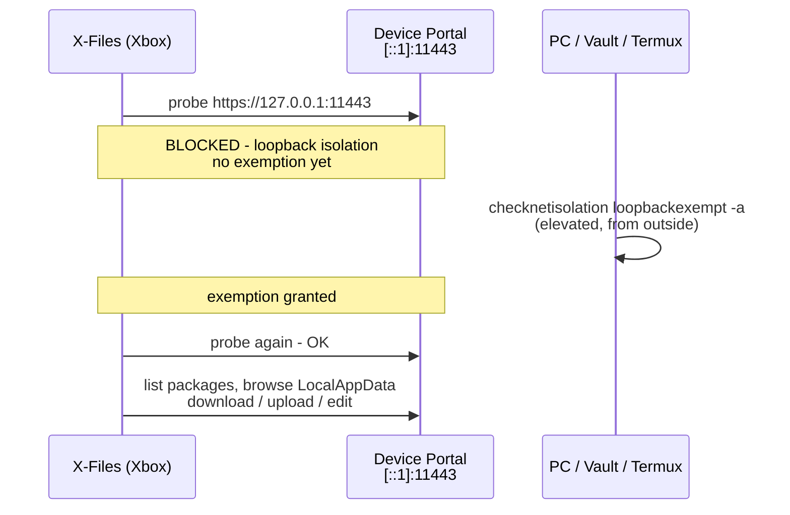

# X-Files Portal — Browse Other Apps' Files on Your Xbox

> **Short version for everyone:** X-Files can show and edit the files of your
> other Xbox apps — RetroArch saves, DuckStation memory cards, dosbox
> configs, screenshots. It needs a **one-time 2-minute unlock** to do that.
> This page explains the unlock (3 easy ways) and, below, how it all works.

---

## 1. Do I need this?

- **Want to see / edit other apps' files** (RetroArch saves, DuckStation memory
  cards, configs)? Go to [§2 Quick start](#2-quick-start--pick-one-way) — it
  takes about 2 minutes and adds a **"User Folders"** entry to the X-Files file list.
- **Only browse your own USB drives / external HDD?** You don't need this page.
  X-Files works normally without it.

- **You need it** if you want the **"User Folders"** entry to appear at the top
  of the X-Files file list. That entry lets you open other apps' `LocalAppData`
  (saves, configs) and `DevelopmentFiles`.
- **You don't need it** if you only browse your own USB drives / external HDD.

---

## 2. Quick start — pick ONE way

All three ways do the exact same thing: they tell the console
*"let X-Files talk to its own Device Portal"*. The unlock takes about 2 minutes.

### Option A — XB Homebrew Vault (PC, easiest)

1. On your PC, get **XB Homebrew Vault**
   ([github.com/vektorvamp xbHomebrewVault](https://github.com/vektorvamp)) — a
   free app for managing Xbox developer mode.
2. Connect Vault to your Xbox (developer-mode IP + portal username/password —
   see [§5 credentials](#5-get-your-values-first)).
3. Open its **Tools** view → **"X-Files Enablement"** (X-Files is pre-selected —
   this button is the quickest way). The generic **"Loopback Exempt"** option
   also works: pick **X-Files** from the list.
4. Confirm — it runs the unlock for you.

Done. No command line needed.

### Option B — script from the ZIP (Windows / Linux / Mac)

The release ZIP ships two scripts in the `tools/` folder. They automate
everything: get the rotating SSH password, find X-Files, apply the exemption.

1. Extract the release ZIP and open the `tools/` folder.
2. Get your **console IP** and **portal username/password**
   (see [§5](#5-get-your-values-first)).
3. Run the script for your system:

   **Windows (PowerShell 7):**
   ```pwsh
   pwsh ./liberate-loopback.ps1 -Ip <XBOX-IP> -User <portal-user>
   ```

   **Linux / macOS (bash):**
   ```bash
   ./liberate-loopback.sh -ip <XBOX-IP> -user <portal-user>
   ```

4. Type the portal password when asked (or pass `-pass <p>`).
5. Wait for **`OK: exemption applied`**.

Full reference: [`tools/README-LIBERATE.md`](../tools/README-LIBERATE.md).

### Option C — Manual (any device, even a phone)

No script, no Vault? Three commands from any SSH terminal
(Windows, Mac, Linux — or **Android** with Termux).

```pwsh
# 1. Get the rotating SSH password (replace user:pass and IP)
curl -k -u <portal-user>:<portal-pass> "https://<XBOX-IP>:11443/ext/smb/developerfolder"

# 2. SSH into the console and unlock
ssh DevToolsUser@<XBOX-IP>
checknetisolation loopbackexempt -a -n=XFiles.Xbox_jgz7qwhvc5jpc
checknetisolation loopbackexempt -s    # verify → look for X-Files
exit
```

> If your X-Files package uses a different publisher hash, the exact package
> name may differ — see [§6.4 Discover the PFN](#64-discover-the-package-family-name-pfn).

---

## 3. Verify it worked

Inside X-Files:

1. Press **Y** on the **About** screen to re-probe the portal (or press
   **Re-probe** in the setup dialog that shows when you drill into
   "User Folders").
2. It should show the portal as **CONNECTED**.
3. Open **"User Folders"** — you can now browse other apps' `LocalAppData` /
   `DevelopmentFiles`, preview files, edit text files, create folders, rename,
   delete, copy, paste, and move between the portal and your drives.

---

## 4. When do I need to unlock again?

Only in two situations (verified by testing):

- After **re-installing / deploying a new build** of X-Files.
- After a **console reboot**.

It survives normal app relaunches. When in doubt, just run the unlock again —
it's quick and harmless.

---

## 5. Get your values first

| What | Where | Example |
|---|---|---|
| **Console IP** | Xbox Dev Home (or Settings → Network → Advanced) | `<XBOX-IP>` |
| **Portal username** | Dev Home → **Device Portal** | `<portal-user>` |
| **Portal password** | Dev Home → **Device Portal** | `<portal-password>` |

These are the same credentials X-Files asks for in its credentials dialog.

---

## 6. How it works (plain language)

Xbox, like Windows, locks every app into a "sandbox". An app cannot open a
network connection to its own console (`127.0.0.1`). But the one elevated
channel available on Xbox Developer Mode is the **Device Portal** — a web API
running on the console itself. X-Files uses it to read other apps' files.

The unlock (loopback exemption) is a small permission that says *"X-Files may
reach its own Device Portal"*. Granting it needs administrator rights **outside**
the app, which is why it's done from a PC / phone (the 3 ways above) and not
from inside X-Files itself.



The portal exposes two browsable areas:

- `GET /api/app/packagemanager/packages` → list apps + **Package Family Name** (PFN)
- `GET /api/filesystem/apps/file?knownfolderid=LocalAppData&packagefullname=<PFN>&path=<dir>` → browse files

---

## 7. Full manual step-by-step

This is the detailed version of **Option C** — what each step does and why.

### 7.1 Portal credentials

Set on the console in Dev Home → **Device Portal**. Two values:

| Field | Example |
|---|---|
| username | `<portal-user>` |
| password | `<portal-password>` |

They are also the HTTP Basic auth for every portal REST call.

### 7.2 Get the rotating SSH password

The SSH password is **different from the portal password and rotates**. Two
ways to get it:

**Via REST (same as xbHomebrewVault does):**

```pwsh
curl -k -u <portal-user>:<portal-password> "https://<XBOX-IP>:11443/ext/smb/developerfolder"
# → {"Password":"<rotating-ssh-password>", ...}
```

**Via Dev Home on the console:** the SSH/SFTP credential is shown in Dev Home.

| SSH value | Value |
|---|---|
| host | console IP |
| port | `22` |
| username | `DevToolsUser` |
| password | rotating value from above |

### 7.3 Discover the Package Family Name (PFN)

The "hash" in `XFiles.Xbox_jgz7qwhvc5jpc` (`jgz7qwhvc5jpc`) is the
**PublisherId**, derived from the signing certificate. You do **not** need to
hardcode it — the portal returns the full PFN:

```pwsh
curl -k -u <portal-user>:<portal-password> "https://<XBOX-IP>:11443/api/app/packagemanager/packages"
# find the object where "Name" == "XFiles.Xbox", read "PackageFamilyName"
```

The default for X-Files is `XFiles.Xbox_jgz7qwhvc5jpc`.

### 7.4 Exempt

```pwsh
ssh DevToolsUser@<XBOX-IP>
checknetisolation loopbackexempt -a -n=XFiles.Xbox_jgz7qwhvc5jpc
# → OK.
exit
```

### 7.5 Verify

```pwsh
ssh DevToolsUser@<XBOX-IP>
checknetisolation loopbackexempt -s
# → look for: Name: XFiles.Xbox_jgz7qwhvc5jpc
exit
```

Inside X-Files: open **About** and run the probe (**Y**). It should show the
portal as **CONNECTED**.

### 7.6 Revert

```pwsh
ssh DevToolsUser@<XBOX-IP>
checknetisolation loopbackexempt -d -n=XFiles.Xbox_jgz7qwhvc5jpc
exit
```

### 7.7 Helper scripts (detailed)

Packaged with the release zip under `tools/`:

| File | Purpose |
|---|---|
| `tools/liberate-loopback.ps1` | Windows (PowerShell 7) |
| `tools/liberate-loopback.sh` | Linux / macOS (bash) |

Both automate 7.2 → 7.5: portal creds → fetch rotating SSH password → discover
PFN from the packages endpoint → run `checknetisolation -a` → verify. See
[`tools/README-LIBERATE.md`](../tools/README-LIBERATE.md).

```pwsh
pwsh ./tools/liberate-loopback.ps1 -Ip <XBOX-IP> -User <portal-user>
```

---

## 8. Feature unlocked once exempted (implemented)

Once exempted, X-Files shows a **"User Folders"** entry at the root of the
Miller columns. Drill in to browse, preview, edit, and manage other apps'
`LocalAppData` / `DevelopmentFiles`:

1. **List apps** — `GET /api/app/packagemanager/packages` → installed packages as folders.
2. **Browse files** — `GET /api/filesystem/apps/file?knownfolderid=LocalAppData&packagefullname=<PFN>&path=<dir>`.
3. **Preview / edit / play** — small files (≤ 25 MB) auto-download into an
   internal cache (`portal-cache`, 2 GB LRU, cleared each launch); larger files
   download on open with a progress dialog. Text files open in the editor; save
   writes back to the portal.
4. **Manage** — Copy / Paste / Move (portal ↔ your drives), New Folder, Rename,
   Delete — the same actions as local files, backed by portal REST calls.

### 8.1 Credentials (persisted)

- Credentials are entered once via the credentials dialog and stored in the
  app's SQLite settings (`PortalUser` / `PortalPass`) — no build-time `.env`
  needed on the console.
- Wrong creds → HTTP 401 → the dialog reappears.
- Re-probe anytime: **About + Y**.

### 8.2 If the drill-in shows the setup screen

The setup dialog explains the three exemption routes (XB Homebrew Vault wizard,
the packaged scripts, or manual SSH below) and shows a **QR code** pointing to
this page. Not connected yet? Apply the exemption, then **Re-probe**.

### 8.3 curl cheat-sheet (write ops, from any device)

Base URL `https://<XBOX-IP>:11443`, Basic auth `-u <portal-user>:<portal-pass>`.

> **`<portal-user>` / `<portal-pass>` are the SAME credentials you use to log in
> to the Device Portal web UI** — the ones set in Dev Home → **Device Portal**
> (see [§5](#5-get-your-values-first)) and the same ones X-Files asks for in its
> credentials dialog. Do **not** use the rotating SSH password from §7.2 here —
> that one is only for `ssh` / SFTP.

Writes need a CSRF token: first `GET /api/os/info` (any page works) → cookie
`CSRF-Token=<token>`; then send header `-H "X-CSRF-Token: <token>"`. Omit
`packagefullname` to list packages; use `%5C` for `\`.

```bash
# list known folders
curl -k -u user:pass "https://<IP>:11443/api/filesystem/apps/knownfolders"

# list installed packages (omit packagefullname)
curl -k -u user:pass "https://<IP>:11443/api/app/packagemanager/packages"

# list files: path is backslash-quirk — root "\" = %5C, one level "\\Settings"
curl -k -u user:pass "https://<IP>:11443/api/filesystem/apps/files?knownfolderid=LocalAppData&packagefullname=<PFN>&path=%5C"

# download a file — filename is a SEPARATE param; path = parent folder only
curl -k -u user:pass -o settings.dat \
  "https://<IP>:11443/api/filesystem/apps/file?filename=settings.dat&packagefullname=<PFN>&path=%5C"

# create folder
curl -k -u user:pass -X POST -H "X-CSRF-Token: <token>" \
  "https://<IP>:11443/api/filesystem/apps/folder?newfoldername=NewDir&packagefullname=<PFN>&path=%5C"

# rename (path = parent)
curl -k -u user:pass -X POST -H "X-CSRF-Token: <token>" \
  "https://<IP>:11443/api/filesystem/apps/rename?filename=old.txt&newfilename=new.txt&packagefullname=<PFN>&path=%5C"

# delete
curl -k -u user:pass -X DELETE -H "X-CSRF-Token: <token>" \
  "https://<IP>:11443/api/filesystem/apps/file?filename=old.txt&packagefullname=<PFN>&path=%5C"
```

**Upload gotcha:** the portal only accepts the browser-style multipart format.
`curl -F "file=@x.txt"` matches it. If the server replies `500 ... WdpTempWebFolder\UPDxxxx.tmp`,
check the multipart first, then reboot dev mode / free package quota.

---

> Implementation details, decisions, and the manual test script live in
> [`docs/portal-appdata/PLAN.md`](portal-appdata/PLAN.md) (D4 = SQLite creds,
> D5 = cache, D6 = 25 MB auto-download, D8 = QR → this page).

Related tooling (already in the repo):

- `XFiles/Services/DevicePortalService.cs` — probe (network + filesystem +
  packages), `ProbeAsync(force)`, `ProbeStatus`, `ProbeCompleted`, plus the
  persistent portal client (read/write APIs, CSRF, 401 handling).
- About + **Y** re-probe on `MillerColumnsPage.Navigation.cs`.
- The **XB Homebrew Vault** project (`xb-homebrew-vault`) implements the same
  REST client and a "Loopback Exempt" wizard in its Tools view.
