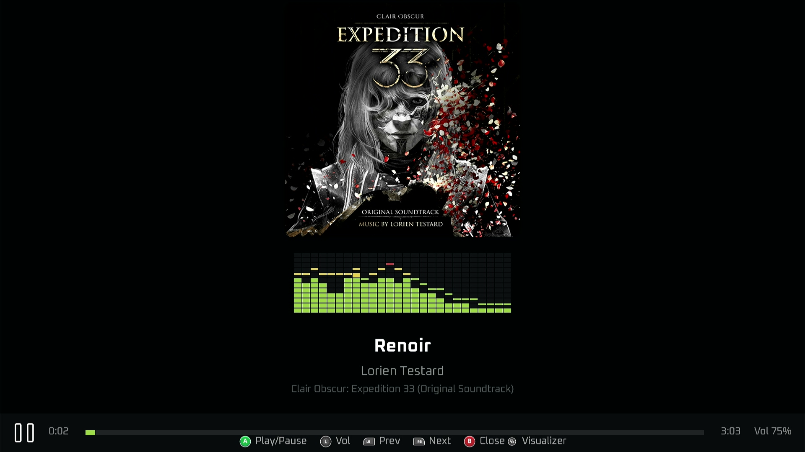
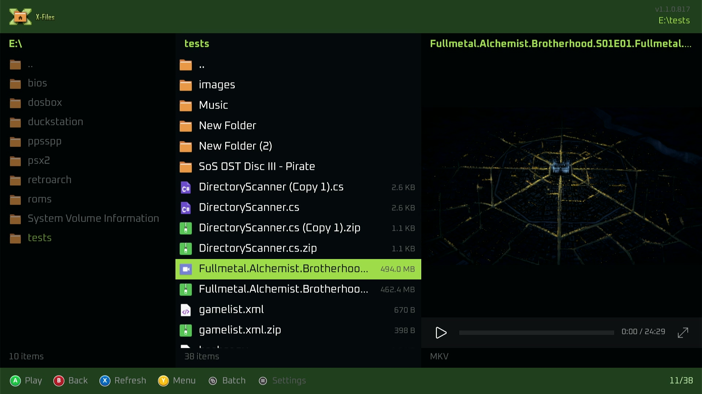
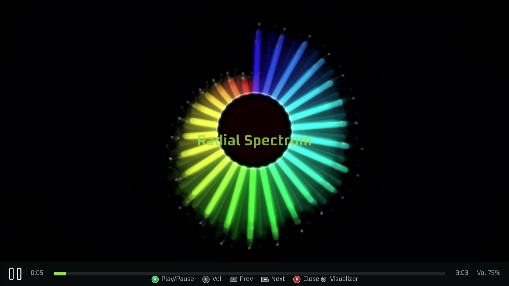
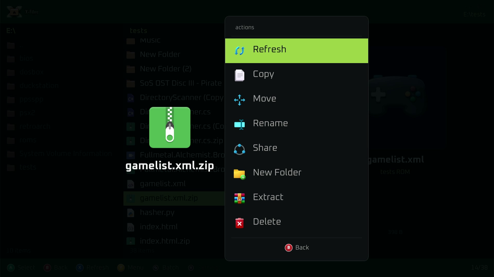
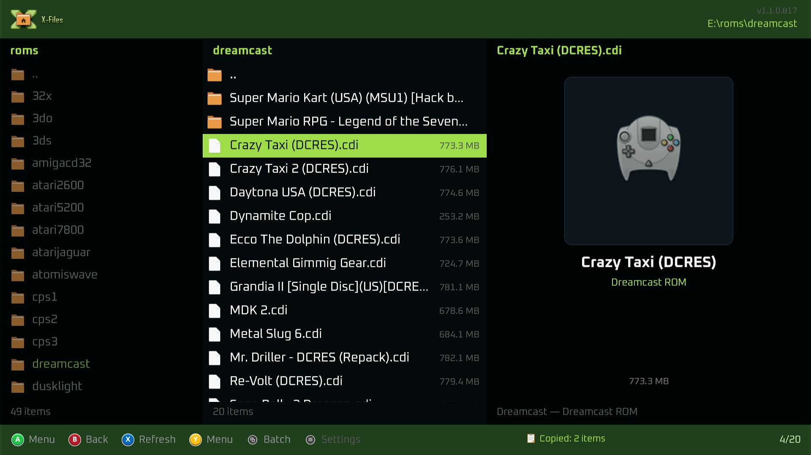
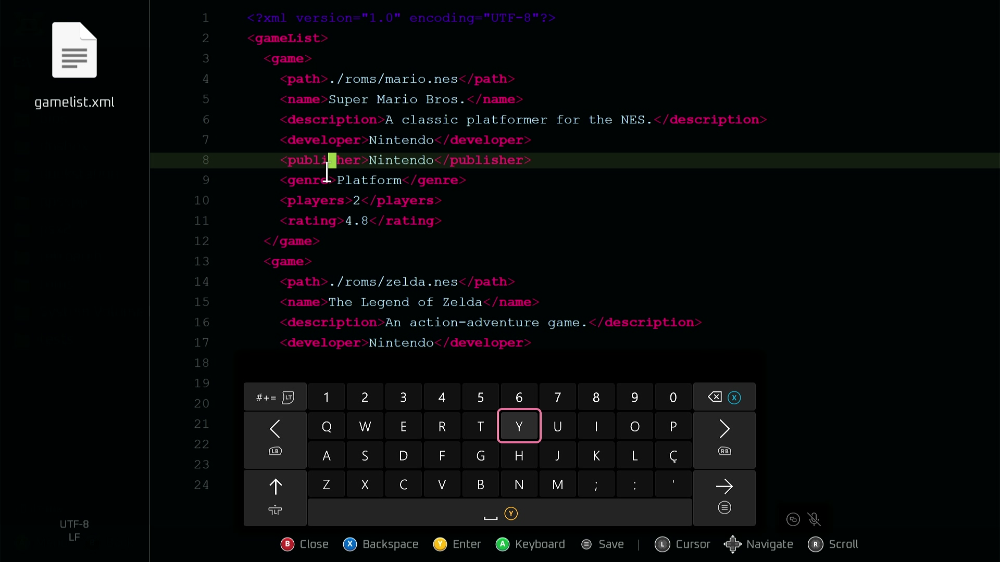

  
  <h1>🕹️ X-Files</h1>
  

    A gamepad-first file browser for Xbox. Browse, preview, and play your music, video,
    and ROMs straight from the couch — no keyboard, no mouse, just the controller.
  

  

    🎮 Gamepad-first
    🎵 Chiptune player
    🎼 Background music
    📊 31 visualizers
    📱 QR sharing
    📄 PDF viewer
  

## What you can do

  <a class="card" href="DEPLOY-XBOX.html">
    <h3>🖥️ Get it running</h3>
    
Install X-Files on your Xbox via Developer Mode.

  </a>
  <a class="card" href="GAMEPAD.html">
    <h3>🎮 Controls</h3>
    
Every button mapped — browse like a pro from the start.

  </a>
  <a class="card" href="bgm/README.html">
    <h3>🎼 Background Music</h3>
    
Your music keeps playing while you explore files.

  </a>
  <a class="card" href="USER-FILES.html">
    <h3>🗂️ Other apps' files</h3>
    
See RetroArch saves, memory cards, and configs — 2-minute setup.

  </a>
  <a class="card" href="FILE-SHARING-QR.html">
    <h3>📱 Share files</h3>
    
Send any file to your phone with a QR code.

  </a>

## Screenshots

  
  
  
  
  
  

## Getting help

- 📖 [User guide](https://github.com/marcelofrau/x-files-uwp/wiki) — step-by-step tutorials for end users.
- ⬇️ [Download releases](https://github.com/marcelofrau/x-files-uwp/releases) — grab the latest package.
- 🐛 [Report an issue](https://github.com/marcelofrau/x-files-uwp/issues) — found a bug? Tell us.

> 🔧 Building or contributing? The full [Developer Docs](DEVELOPERS.html) cover the
> architecture, specs, and release process.
